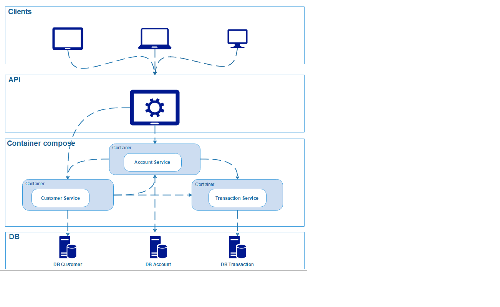

# Open Customer Account

Open Account v1 is a repo that consists of 3 services which communicate each other in order to open a new account for a customer who execute a transaction with specific amount.

## Micro Services
- Service.Customer
Customer service is responsible for customer data and functionality exposed an API
- Service.Account
Account service is responsible for customer's account details exposed an API
- Service.Transaction
Transaction service is responsible for customer's transaction details exposed an API

## Stack of services
- .NET Core 3.1.
- ASP.NET Web-API
- Mailkit (cross-platform .NET library for IMAP)

## Installation via Docker compose

1. Download the repo through [github](https://github.com/steliosb/Service.OpenAccount) or simply
   ```bash
    git clone https://github.com/steliosb/Service.OpenAccount.git
   ```
2. Install Docker platform
  - Windows users from [docker windows](https://www.docker.com/products/docker-desktop)
  - Ubuntu users from [community](https://docs.docker.com/install/linux/docker-ce/ubuntu/) or [enterprise](https://docs.docker.com/ee/docker-ee/ubuntu/)
3. Run the `docker-compose up --build -d` file (using console) that resides in the top-level directory of the solution.

> **Note:** *Docker-compose will run 3 services on release enviroment*

## Installation through Visual Studio
1. Install [.NET Core 3.1](https://dotnet.microsoft.com/download/dotnet-core/3.1) SDK on your local machine
2. Download the repo through [github](https://github.com/steliosb/Service.OpenAccount) or simply
  ```bash
     git clone https://github.com/steliosb/Service.OpenAccount.git
  ```
3. From solution select multiple startup projects in order to run API
  - Service.OpenAccount.Accounts.WebApi
  - Service.OpenAccount.Cusotmers.WebApi
  - Service.OpenAccount.Transactions.WebApi
4. Start project on Debug mode
 
## Test APIs Functionality
1. Accept users information
  - http://localhost:5002/api/accounts/create and json request
    ```bash
    "customerid" : 1,
    "initialCredit": 100
    ```
2. User information
  - http://localhost:5004/api/customer/detail and json request
    ```bash
     "customerid" : 1
    ```
 
## Usage
A useful API specification can be found via swagger tool here: 
 - [Service.Customers API](http://localhost:5004/swagger)
 - [Service.Accounts API](http://localhost:5002/swagger)
 - [Service.Transactions API](http://localhost:5000/swagger)
> **Note:** *APIs specifications will be accessible after project running*

## Services Diagram


## Support
sbalampanis@gmail.com

## Contributing
Pull requests are welcome. For major changes, please open an ticket first to discuss what you would like to change.

### Author and acknowledgment
*Stelios Balampanis*
